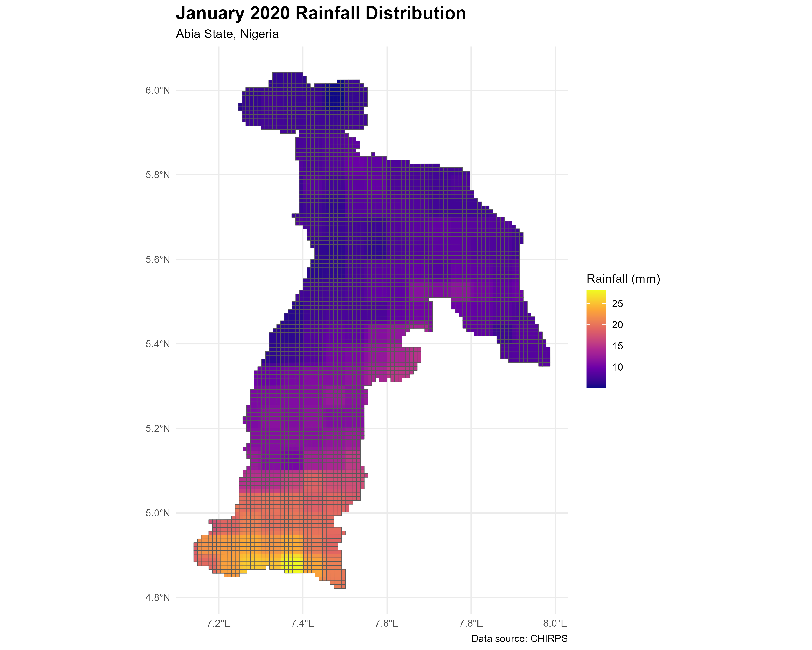
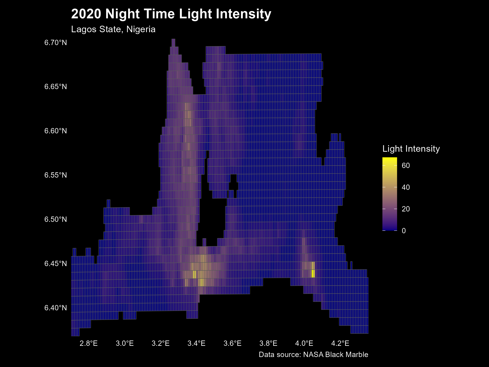
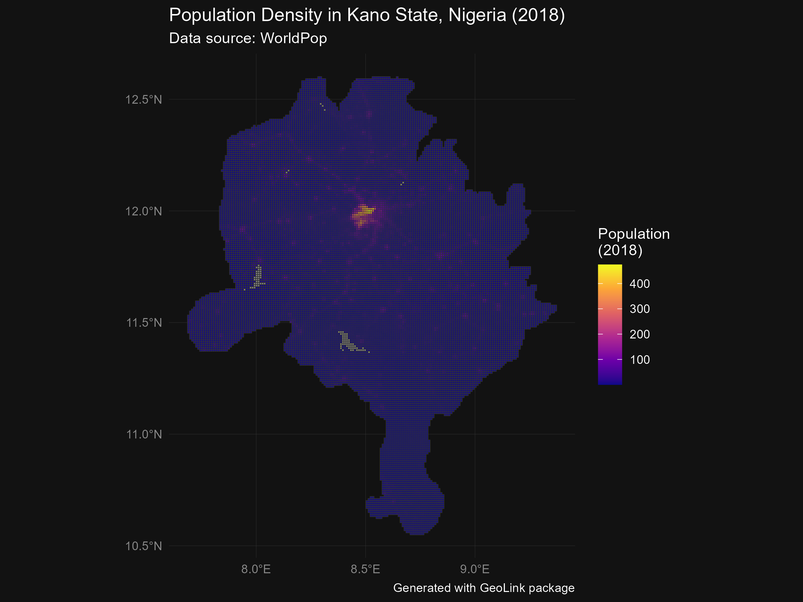
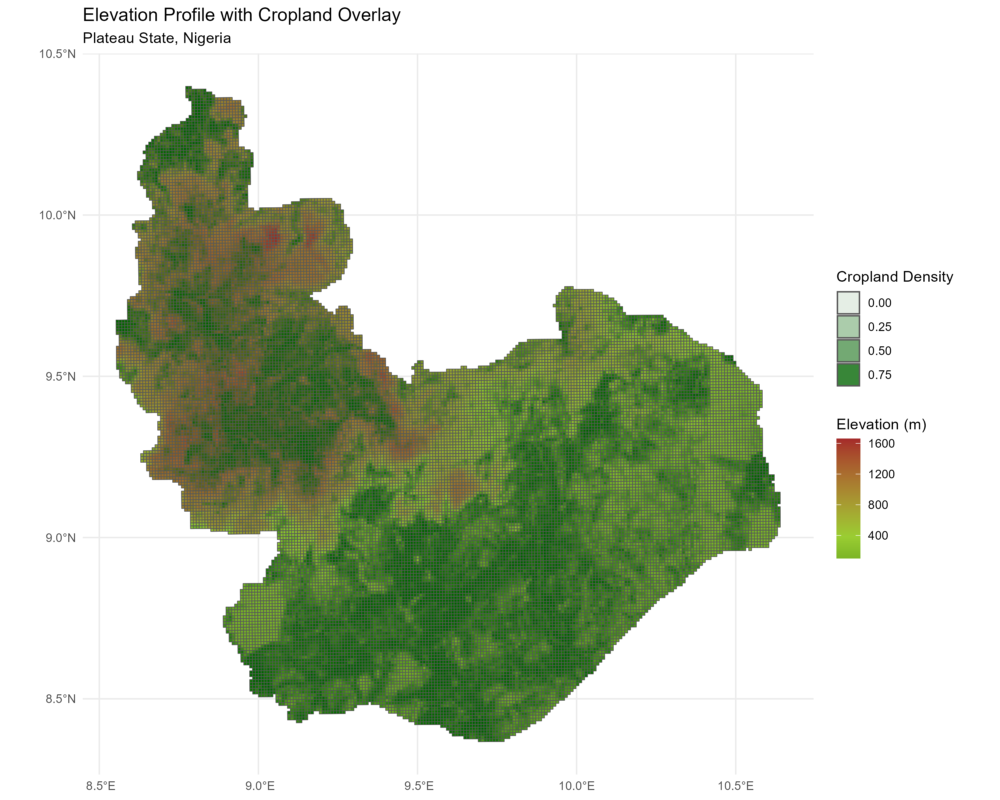

```{r setup, include=FALSE}
knitr::opts_chunk$set(echo = TRUE, eval = FALSE)
```

# GeoLink 🌍

<!-- badges: start -->

[](https://github.com/SSA-Statistical-Team-Projects/GeoLink/actions/workflows/R-CMD-check.yaml)
[](https://opensource.org/licenses/MIT)
[](https://github.com/SSA-Statistical-Team-Projects/geolink/issues)

<!-- badges: end -->

GeoLink is an R package that provides easy access to various geospatial
datasets, allowing seamless integration with your spatial data or
household surveys.

## 📋 Table of Contents

-   [Features](#-features)
-   [Installation](#-installation)
-   [Usage](#-usage)
-   [Data Visualization Examples](#️-data-visualization-examples)
-   [Basic Usage Examples](#-basic-usage-examples)
-   [Documentation](#-documentation)
-   [Contributing](#-contributing)
-   [License](#-license)

## ✨ Features

Download and process:

-   CHIRPS rainfall data
-   Night Time Light (NTL) data
-   Population data (WorldPop)
-   Elevation data
-   Building data (WorldPop)
-   CMIP6 climate model data
-   Cropland data
-   WorldClim climate data
-   Terraclimate data
-   Land Use Land Cover data
-   Points of Interest (OpenStreetMap)
-   Electrification access data (HREA)
-   OpenCellID data
-   Pollution
-   Vegetation Index

## 🚀 Installation

```{r}
# Install devtools if you haven't already
install.packages("devtools")

# Install GeoLink
devtools::install_github("SSA-Statistical-Team-Projects/GeoLink")

# Load the package
library(GeoLink)
```

## 📊 Usage

Most functions require either: - A shapefile (`shp_dt` or `shp_fn`) - OR
a household survey dataset (`survey_dt` or `survey_fn`) with coordinates

## 🗺️ Data Visualization Examples

### 1. Rainfall Visualization

```{r}
library(ggplot2)
library(sf)
library(viridis)

# Get rainfall data
rainfall_map <- geolink_chirps(
    time_unit = "month",
    start_date = "2020-01-01",
    end_date = "2020-01-31",
    shp_dt = shp_dt[shp_dt$ADM1_EN == "Abia",],
    grid_size = 1000
)

# Create beautiful rainfall map
ggplot(rainfall_map) +
    geom_sf(aes(fill = rainfall_month1)) +
    scale_fill_viridis_c(
        name = "Rainfall (mm)",
        option = "plasma"
    ) +
    theme_minimal() +
    labs(
        title = "January 2020 Rainfall Distribution",
        subtitle = "Abia State, Nigeria",
        caption = "Data source: CHIRPS"
    ) +
    theme(
        plot.title = element_text(size = 16, face = "bold"),
        legend.position = "right"
    )
```



### 2. Night Time Lights Analysis

```{r}
# Get night time lights data
ntl_map <- geolink_ntl(
    time_unit = "annual",
    start_date = "2020-01-01",
    end_date = "2020-12-31",
    shp_dt = shp_dt[shp_dt$ADM1_EN == "Lagos",],
    indicator = "average_masked",
    grid_size = 1000
)

# Create illuminating visualization
ggplot(ntl_map) +
    geom_sf(aes(fill = ntl_annual1average_masked)) +
    scale_fill_gradient(
        low = "navy",
        high = "yellow",
        name = "Light Intensity"
    ) +
    theme_minimal() +
    labs(
        title = "2020 Night Time Light Intensity",
        subtitle = "Lagos State, Nigeria",
        caption = "Data source: NASA Black Marble"
    ) +
    theme(
        panel.background = element_rect(fill = "black"),
        plot.background = element_rect(fill = "black"),
        text = element_text(color = "white"),
        plot.title = element_text(color = "white", size = 16, face = "bold")
    )
```



### 3. Interactive Population Density

```{r}
library(leaflet)

# Get population data
pop_data <- geolink_population(
  start_year = 2018,
  end_year = 2018,
  iso_code = "NGA",
  constrained = 'N',
  UN_adjst = 'N',
  shp_dt = shp_dt[shp_dt$ADM1_EN == "Kano",],
  grid_size = 1000,
  extract_fun = "mean"
)

# Create interactive population map
leaflet(pop_data) %>%
    addProviderTiles(providers$CartoDB.DarkMatter) %>%
    addPolygons(
        fillColor = ~colorQuantile("YlOrRd", population_2018)(population_2018),
        fillOpacity = 0.7,
        weight = 1,
        color = "#666",
        popup = ~paste(
            "<strong>Area:</strong>", 
            "<br>Population:", round(population_2018),
            "<br>Density:", round(population_2018/st_area(geometry))
        )
    ) %>%
    addLegend(
        "bottomright",
        title = "Population Density",
        pal = colorQuantile("YlOrRd", pop_data$population_2018),
        values = ~population_2018
    )
```



### 4. Elevation Profile with Cropland Overlay

```{r}
# Combine elevation and cropland data
elevation_data <- geolink_elevation(
    iso_code = "NGA",
    shp_dt = shp_dt[shp_dt$ADM1_EN == "Plateau",],
    grid_size = 1000
)

cropland_data <- geolink_cropland(
    shp_dt = shp_dt[shp_dt$ADM1_EN == "Plateau",],
    grid_size = 1000
)


# Create combined visualization
ggplot(elevation_data) +
  geom_sf(aes(fill = NGA_elv_msk)) +
  geom_sf(data = cropland_data, aes(alpha = cropland), fill = "darkgreen") +
  scale_fill_gradient2(
    low = "darkgreen",
    mid = "yellowgreen",
    high = "brown",
    midpoint = median(elevation_data$NGA_elv_msk),
    name = "Elevation (m)"
  ) +
  scale_alpha_continuous(name = "Cropland Density") +
  theme_minimal() +
  labs(
    title = "Elevation Profile with Cropland Overlay",
    subtitle = "Plateau State, Nigeria"
  )
```



## 📝 Basic Usage Examples

### Rainfall Data (CHIRPS)

```{r}
df <- geolink_chirps(
    time_unit = "month",
    start_date = "2020-01-01",
    end_date = "2020-03-01",
    shp_dt = shp_dt[shp_dt$ADM1_PCODE == "NG001",],
    grid_size = 1000
)
```

### Night Time Lights

```{r}
df <- geolink_ntl(
    time_unit = "month",
    start_date = "2020-01-01",
    end_date = "2020-03-01",
    shp_dt = shp_dt[shp_dt$ADM1_PCODE == "NG001",],
    indicator = "avg_rade9h",
    grid_size = 1000
)
```

### Population Data

```{r}
df <- geolink_population(
    start_year = 2018,
    end_year = 2019,
    iso_code = "NGA",
    shp_dt = shp_dt[shp_dt$ADM1_EN == "Abia",],
    grid_size = 1000
)
```

## 📚 Documentation

For detailed documentation of each function, use R's help system:

```{r}
?geolink_chirps
?geolink_ntl
?geolink_population
```

### Memory Considerations

When working with geospatial data, memory management is crucial,
especially on laptops:

-   **Large raster operations**: Many GeoLink functions process large
    raster files that can consume significant RAM
-   **Geographic chunking**: Consider processing large areas by dividing
    them into smaller regions
-   **Grid size adjustment**: Increase `grid_size` parameter to reduce
    resolution and memory requirements
-   **Temporary file cleanup**: Use `raster::removeTmpFiles(h=0)`
    periodically to clean up temp files

#### Optimizing R Memory on Laptops

To maximize available memory for GeoLink on your laptop:

```{r}
# Increase R's memory limit (Windows)
memory.limit(size=10000)  # Set to 10GB if available

# Clear R environment before large operations
rm(list = ls())
gc()

# Configure raster package to use disk instead of RAM
raster::rasterOptions(maxmemory = 1e9)  # 1GB RAM limit
raster::rasterOptions(tmpdir = "C:/R_temp")  # Custom temp directory

# Monitor memory usage
mem_used <- pryr::mem_used()  # Requires 'pryr' package
print(paste0("Current memory usage: ", round(mem_used/1e6, 2), " MB"))

# Close other applications and disable memory-intensive R features
options(device.ask.default = FALSE)  # Disable interactive graphics prompts
```

#### Handling Very Large Datasets

For extremely large geospatial operations:

-   Use `terra` package instead of `raster` for more efficient memory
    usage
-   Consider parallel processing with `parallel` or `future` packages
-   Pre-filter your area of interest to the smallest necessary extent
-   Export intermediate results to disk using `sf::write_sf()` or
    `terra::writeRaster()`
-   Consider cloud-based computation for nationwide or continental
    analyses

### Error Handling

GeoLink implements robust error handling to gracefully manage common
issues when working with geospatial data:

#### Input Validation

```{r}
# Invalid file format detection
df <- geolink_population(survey_fn = "invalid.txt")
# Error: "Unsupported file format. Please provide .dta file"

# Missing required parameters
df <- geolink_chirps()
# Error: "start_date and end_date must be specified"

# Invalid parameter values
df <- geolink_ntl(time_unit = "weekly")
# Error: "Time unit should either be month or annual"
```

#### Coordinate Reference System (CRS) Management

```{r}
# Automatic CRS detection and reprojection
df <- geolink_chirps(shp_dt = invalid_crs_data)
# Message: "Reprojecting from XXXX to EPSG:4326"

# All GeoLink functions use ensure_crs_4326() internally to handle CRS issues
```

#### Temporary File Management

```{r}
# Proper resource allocation and deallocation
on.exit(raster::removeTmpFiles(h=0))
```

#### Large Area Processing

```{r}
# Intelligent splitting of large areas into manageable chunks
# For OpenStreetMap data:
if (bbox_area > area_threshold) {
  message("Large area detected. Splitting into quadrants...")
  # Process quadrants separately and combine results
}
```

#### Common Error Solutions

If you encounter errors, try these common solutions:

1.  **Memory errors**: Increase grid size or use resampling
2.  **Connection timeouts**: Check internet connection
3.  **Missing data**: Verify date ranges are valid for the selected
    dataset
4.  **Invalid geometries**: Clean your shapefile using
    `sf::st_make_valid()`
5.  **Projection errors**: Ensure input data has defined coordinate
    systems

### Benchmarking

`GeoLink` offers straightforward access to a wide range of geospatial
variables without requiring expertise in the data or the tools needed to
access them. When compared to packages such as `BlackMarbleR`, `chirps`,
`climateR`, and `cmip6`, `GeoLink` shows mixed performance results in
terms of speed. Using microbenchmark to evaluate `GeoLink`'s performance
alongside these different packages, we have compiled the results (in
seconds) in the table below.

However, other packages involve additional steps and require technical
expertise, which can lengthen the time needed to achieve the desired
results. For example, `BlackMarbleR` necessitates a subscription to a
website and produces raster data instead of vector data (such as a
shapefile). The `cimp6` package failed to obtain rasters in 7 out of 10
attempts, whereas `GeoLink` successfully collected data in all
instances. Additionally, `climateR` provides daily raster data that
needs to be summarized into monthly or yearly figures.

| Variable        | Package        | min    | lq     | mean   | median | uq     | max    | neval |
|--------|--------|--------|--------|--------|--------|--------|--------|--------|
| Nightime lights | `BlackMarbleR` | 7.77   | 8.05   | 8.28   | 8.33   | 8.55   | 8.67   | 10    |
|                 | `GeoLink`      | 30.22  | 34.54  | 37.68  | 36.50  | 40.51  | 47.96  | 10    |
| CHIRPS          | `CHIRPS`       | 138.99 | 139.53 | 148.70 | 144.09 | 154.15 | 174.31 | 10    |
|                 | `GeoLink`      | 6.36   | 7.01   | 7.39   | 7.28   | 7.65   | 9.20   | 10    |
| TerraClimate    | `climateR`     | 1.20   | 1.30   | 1.31   | 1.32   | 1.34   | 1.35   | 10    |
|                 | `GeoLink`      | 5.40   | 6.42   | 10.69  | 8.31   | 11.44  | 30.15  | 10    |
| CMIP6           | `cmip6`        | 11.06  | 11.43  | 16.91  | 17.79  | 20.69  | 24.18  | 10    |
|                 | `GeoLink`      | 335.36 | 347.13 | 356.53 | 352.17 | 365.97 | 380.32 | 10    |

## 🤝 Contributing

Contributions are welcome! Please feel free to submit a Pull Request.
For major changes, please open an issue first to discuss what you would
like to change.

1.  Fork the Project
2.  Create your Feature Branch
    (`git checkout -b feature/AmazingFeature`)
3.  Commit your Changes (`git commit -m 'Add some AmazingFeature'`)
4.  Push to the Branch (`git push origin feature/AmazingFeature`)
5.  Open a Pull Request

## 📄 License

This project is licensed under the MIT License - see the
[LICENSE.md](LICENSE.md) file for details.

## 📫 Contact

Project Link: <https://github.com/SSA-Statistical-Team-Projects/GeoLink>

Maintainers: [Diana Jaganjac](mailto:djaganjac@worldbank.org) and
[Ifeanyi Edochie](mailto:iedochie@worldbank.org)

------------------------------------------------------------------------

Made with ❤️ by [The World Bank Group & The University of Southampton]
